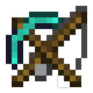

  

# MineClicker

Introducion
-----
MineClicker is software AutoClicker special for Minecraft (Bedrock), Easy for use, and minimal lag

## How To use

#### AFK Fishing

- Change to **AFK Fishing (Right Click)** in **Click Function**
- Setting **Delay Click**, if 1 Second = 1000 Intervals, You can change units from seconds to intervals
- The delay limit of MineClicker is 200 to 99,999 intervals (0.2 - 99,999 seconds)
- You can also limit the number of clicks (**Time Repeat**) in MineClicker, 0 is unlimited
- Minimize, open your Minecraft world, then press **F6** (default) or your settings keyboard button to start AFK FIshing

#### Auto Breaker

- Coming Soon

## Settings

#### General

- **Key to Play**: changing keyboard key for play & stop after play minecraft (Default: **F6**)
- **Starting Faster**: First click running without Delay (Default: **Active**)

#### Background

- **Set Notify as Indicator**: Show notify in taskbar, Grey is not active and Color as Active (Default: **Active**)
- **Hide to Minimize**: Hide taskbar if minimized, double click taskbar for show this software setting is Inactive if **Set Notify as Indicator** as inactive (Default: **Active**)
